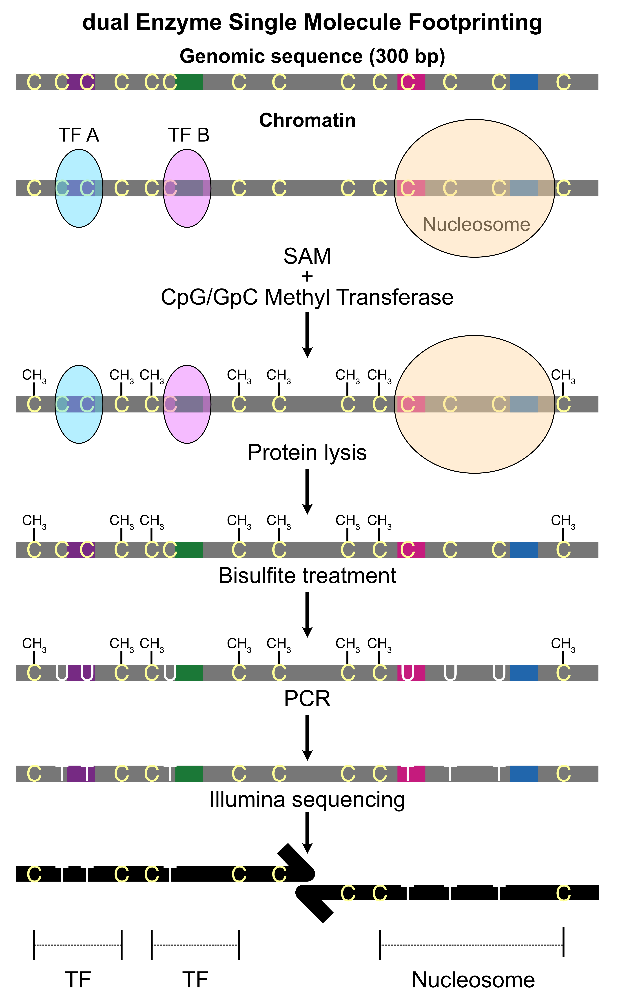

```{r setup, include=FALSE}
knitr::opts_chunk$set(echo = TRUE)
options(warn=-1)
```

## Introduction
Single-molecule assays like NOMe-seq, and dSMF are superior to DNase-seq and ATAC-seq as they do not cleave DNA (see schematics below). Thus, they enable quantification of all three i.e., protein-free, Transcription Factor-bound and histone-complex-bound states. But a user-friendly tool to visualize and quantify such states is lacking. SMTrackR, a Bioconductor package visualizes protein-DNA binding states on individual sequenced DNA molecules. SMTrackR queries the single-molecule footprint database we built and hosted at Galaxy Server. It comprises of BigBed files generated from NOMe-seq and dSMF datasets. SMTrackR exploits UCSC REST API to query a BigBed file and plot footprint heatmap categorized in different binding states as well as report their occupancies.

```{r, echo=FALSE, out.width="70%", fig.align="center"}

```

## Installation
```{r, echo = T}
# if (!require("BiocManager", quietly = TRUE))
#     install.packages("BiocManager")
# 
# BiocManager::install("SMTrackR")
# rmarkdown::html_vignette
```
## Loading the package
```{r Load package, echo=TRUE}
library(SMTrackR)
```
## Plot Single Molecules from SMF Data

`SMTrackR::plotFootprints()` will generate the heatmap `pdf` file stored in `<target_dir>/plots/<label>.heatmap.pdf` if `target_dir` option is provided, otherwise the plot will be saved in the `tempdir`, the fuction reports the path in both the cases. 
A `Gviz` compatible code can also be generated by running the `generateGvizCodeforSMF` function. See the code chunk below. 


```{r plot psuedo-bulk scNOMe-seq data, fig.width=4.5, fig.height=6, echo=TRUE}
SMTrackR::plotFootprints(organism = "mmusculus", model = "8cell", condition = "WT", 
                         genome_assembly = "mm10", type = "SMF", chromosome = "chr5", 
                         start = 113847750,  end  = 113847780, tr = "8cell", 
                         label = "8cell", fp_cap = 50, remove_dup = TRUE, target_dir = "smf")
SMTrackR::generateGvizCodeforSMF(organism = "mmusculus", model = "8cell", condition = "WT",
                                 genome_assembly = "mm10", type = "SMF", chromosome = "chr5", 
                                 start = 113847750,  end = 113847780, tr = "8cell", 
                                 label = "8cell", fp_cap = 50, remove_dup = TRUE,
                                 gviz_left = 1000, gviz_right = 1000, target_dir = "smf")

```

## Plot Single Molecules from dSMF Data

To learn more about dSMF data, please read the article [Krebs et al., Mol. Cell., 2017](https://pubmed.ncbi.nlm.nih.gov/28735898/). Briefly, it uses two exogenous methyltransferases in tandem to map protein-DNA binding on individual sequenced DNA molecules.

The command below will generate `plots/peak229.plot.pdf` file.
```{r Plot dSMF data, fig.width=4.5, fig.height=6, echo=TRUE}
SMTrackR::plotFootprints(target_dir = "dsmf")
```


## Plot Single Molecules from Nanopore Data

Running the command below will generate a pdf file `plots/smac_seq.plot.pdf`. 

```{r Plot Methylation Calls on Nanopore Reads, fig.width=10, fig.height=5, echo=TRUE}
SMTrackR::plotMethylationCallsNanopore(target_dir = "nanopre") 
```

## Listing Available Track

All uptodate tracks are available [here](https://docs.google.com/spreadsheets/d/1eu2Y2S0lyAUqxlvtnPBCO55OrxidYV7SwVRkqelPcKk/edit?gid=0#gid=0) and can be listed using the following command.  
```{r List available tracks, echo = TRUE}

#SMTrackR::listTracks()
```


## Session Info
```{r Session Info, echo = TRUE}
sessionInfo()
```
